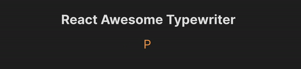

<h1 align="center"> 〰 ⌨️ 〰 React Typewriter 〰 ⌨️ 〰</h1>
<p align="center">
 

<a href="https://www.npmjs.com/package/react-awesome-typewriter" target="_blank">

</a>

</p>

<p align="center">

</p>

<p>
React Awesome Typewriter is a simple component that allows maximum customization on the "typewriter" effect to an array of text that you might need. You can use your own custom classes to provide the type of styling to your text. <a href="#" target="_blank">Try the Demo</a>
</p>

## Installation

For npm

```sh
npm i react-ts-typewriter
```

For yarn

```sh
yarn add react-ts-typewriter
```

## Example usage

```css
.text-secondary {
  color: #535bf2;
}

.text-primary {
  color: #f2a154;
}

.text-big {
  font-size: 3rem;
}

.text-small {
  font-size: 1.5rem;
}
```

```tsx
import ReactAwesomeTypewriter from "react-awesome-typewriter";

const OPTIONS = [
  [
    { text: "Primary Text ", classNames: "text-primary text-big" },
    { text: "Secondary Text ", classNames: "text-secondary text-big" },
    { text: "Normal Text ", classNames: "text-big" },
  ],
  [
    { text: "Big Text ", classNames: "text-big" },
    { text: "Small Text", classNames: "text-small" },
  ],
];

export default function Main() {
  return (
    <h1>
      <ReactAwesomeTypewriter options={OPTIONS} />
    </h1>
  );
}
```

## Props

<table>
   <thead>
      <tr>
         <td><b>Prop name</b></td>
         <td><b>Type</b></td>
         <td><b>Description</b></td>
         <td><b>Required</b></td>
         <td><b>Default</b></td>
      </tr>
   </thead>
   <tbody>
      <tr>
         <td>options</td>
         <td>{text: string, className:string}[]</td>
         <td>Text to display as the typewriter effect</td>
         <td>true</td>
         <td></td>
      </tr>
      <tr>
         <td>forwardSpeed</td>
         <td>number</td>
         <td>Speed of forward typing (in ms)</td>
         <td>false</td>
         <td>60</td>
      </tr>
      <tr>
         <td>backwardSpeed</td>
         <td>number</td>
         <td>Speed for backspacing (in ms)</td>
         <td>false</td>
         <td>25</td>
      </tr>
      <tr>
         <td>waitTime</td>
         <td>number</td>
         <td>Wait time after text is complete (in ms)</td>
         <td>false</td>
         <td>4000</td>
      </tr>
      <tr>
         <td>cursorColor</td>
         <td>string</td>
         <td>Color of the blinking cursor</td>
         <td>false</td>
         <td>#FFF</td>
      </tr>
      <tr>
         <td>cursorHeight</td>
         <td>string</td>
         <td>Height of the blinking cursor</td>
         <td>false</td>
         <td>2.25rem</td>
      </tr>
      <tr>
         <td>cursorWidth</td>
         <td>string</td>
         <td>Width of the blinking cursor</td>
         <td>false</td>
         <td>3px</td>
      </tr>
      <tr>
         <td>cursorGap</td>
         <td>string</td>
         <td>Gap from the last character to cursor</td>
         <td>false</td>
         <td>10px</td>
      </tr>
      <tr>
         <td>cursorAnimationDuration</td>
         <td>number</td>
         <td>Duration of cursor blink animation (in ms)</td>
         <td>false</td>
         <td>700</td>
      </tr>
      
   </tbody>
</table>
